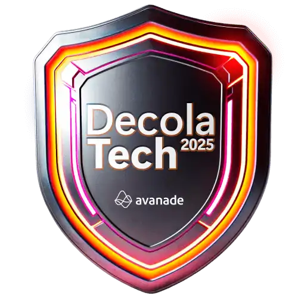
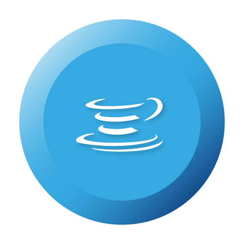

# 🚀 Decola Tech - DIO

Repositório dedicado às atividades, desafios e projetos desenvolvidos durante o bootcamp **Decola Tech 2025** da avanade 

## 📌 Sobre o Bootcamp
O **Decola Tech** é um programa de capacitação voltado para o desenvolvimento de habilidades técnicas e práticas em tecnologia, abordando conceitos fundamentais de programação, desenvolvimento web e outras áreas essenciais para o mercado de trabalho.

## 🛠 Tecnologias e Ferramentas
Durante o bootcamp, foram utilizadas diversas tecnologias, incluindo:

- Java e Springboot
- API RESTful
- Banco de Dados (SQL e NoSQL)
- Git e GitHub

## 📂 Estrutura do Repositório
O repositório está organizado da seguinte maneira:
```
📁 decolatech-dio
 ┣ 📂 img
 ┃ ┣ 🖼️ badges.png
 ┣ 📂 desafios
 ┃ ┣ 📂 desafio1
 ┃ ┃ ┣ 📜 README.md
 ┃ ┃ ┣ 📜 index.html
 ┃ ┃ ┣ 📜 script.js
 ┃ ┃ ┣ 📜 style.css
 ┃ ┣ 📂 desafio2
 ┣ 📂 projetos
 ┃ ┣ 📂 projeto-final
 ┃ ┃ ┣ 📜 README.md
 ┃ ┃ ┣ 📜 index.html
 ┃ ┃ ┣ 📜 script.js
 ┃ ┃ ┣ 📜 style.css
 ┗ 📜 README.md
```

## 📌 Atividades e Projetos
- **Módulo 1:** Introdução à programação, lógica e fundamentos da web.
- **Módulo 2:** Desenvolvimento de aplicações front-end e back-end.
- **Projeto Final:** Aplicação prática utilizando os conceitos aprendidos.

## Bagdes 🏅 

`Clique na Badge para visualizar o certificado`

- **Setup de ambiente Spring**

<table>
  <tr>
    <td>
        <a href="https://hermes.dio.me/certificates/LPNYIKFM.pdf"></a>
    </td>
      <td>
        <a href="https://hermes.dio.me/certificates/7YMKYANB.pdf"></a>
    </td>
      <td>
        <a href="https://hermes.dio.me/certificates/Z5JPLGRD.pdf"></a>
    </td>
  </tr>
  </table>

  - **Desenvolvimento de API's com Spring Framework**

  <table>
  <tr>
    <td>
        <a href="https://hermes.dio.me/certificates/Z1H1DAVO.pdf"></a>
    </td>
  </tr>
  </table>


  - **Integração de Sistemas com Banco de Dados**

  - **Introdução a Angular**

  - **Contruindo Aplicações Angular**

  - **Serviços Cloud com foco em IA**


## 📜 Licença
Este projeto está sob a licença MIT. Sinta-se à vontade para utilizá-lo e adaptá-lo conforme necessário.

## 👩🖥 Desenvolvedora

| ![Alice Sena][img] |
|:--------------------:|
| [**Alice Sena**](https://www.linkedin.com/in/alicessenapereira/)      |
| **Desenvolvedora FullStack**     |

[img]: https://i.imgur.com/xRyocfv.png